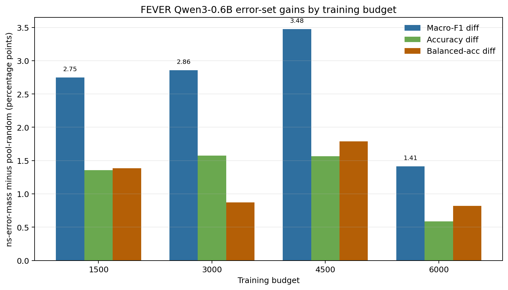

| --- | --- | --- | --- | --- | --- | --- |


- `experiments/inputs/fever/data.jsonl`
- `experiments/inputs/fever/embeddings.npy`
- `experiments/inputs/fever/embeddings.ids.jsonl`
- `experiments/inputs/fever/embeddings.meta.json`
- `experiments/inputs/fever/cgsd_split_ids.json`
- `experiments/inputs/fever/round_0/all_student_predictions.jsonl`
- `experiments/inputs/fever/round_0/calibration_student_predictions.jsonl`
- `experiments/inputs/fever/round_0/pool_student_predictions.jsonl`
- `experiments/inputs/fever/round_0/final_calibration_student_predictions.jsonl`


| --- | ---: | --- |
| calibration | 1000 | CRC calibration/guide |
| round0 all | 165447 | calibration + pool + final_calibration |

| ---: | ---: | ---: |
| 1500 | 0.91% | 0.91% |
| 3000 | 1.83% | 1.81% |
| 4500 | 2.74% | 2.72% |
| 6000 | 3.65% | 3.63% |
| 7500 | 4.57% | 4.53% |
| 9000 | 5.48% | 5.44% |


| split | n | label0 | label1 | pred0 | pred1 | base-error | error-rate |
| --- | ---: | ---: | ---: | ---: | ---: | ---: | ---: |
| guide/calibration | 1000 | 461 | 539 | 892 | 108 | 479 | 47.90% |
| final_calibration | 200 | 94 | 106 | 176 | 24 | 92 | 46.00% |
| pool | 164247 | 78191 | 86056 | 147824 | 16423 | 78871 | 48.02% |


| --- | ---: | ---: | ---: | ---: | ---: | ---: |
| guide/calibration | 1000 | 287 | 713 | 71.30% | 380 | 53.30% |


| ---: | ---: | ---: | ---: | ---: | ---: | ---: | ---: | ---: | ---: |
| 1 | 0.1 | 0.906121 | 164247 | 45599 | 118648 | 72.24% | 37.16% | 47.90% | 53.30% |


| --- | ---: |
| calibration n | 1000 |
| calibration defer n | 713 |
| calibration error n | 479 |
| calibration defer error n | 380 |
| r_C | 0.713 |
| r_U | 0.722375 |
| tau_crc | 2.267171 |
| c_crc | 1.112650 |
| eta_crc | 0.315556 |
| s_accept | 0.253303 |
| s_defer | 0.746697 |

Retired one-off FEVER budget-sweep generator, preserved here only as historical
provenance:

```bash
python retired_fever_budget_sweep_generator \
  --output_dir experiments/inputs/fever/qwen06b_round0_t1_alpha010_budget_sweep_1500_9000_seed1 \
  --budgets 1500,3000,4500,6000,7500,9000 \
  --seed 1 \
  --temperature 1 \
  --alpha 0.1 \
  --embedding_dim 2560
```

| ---: | --- | ---: | ---: | ---: | ---: | ---: | ---: | ---: | ---: |
| 1500 | pool-random | 1500 | 434 | 1066 | 71.07% | 695 | 46.33% | 715 | 785 |
| 1500 | ns-error-mass | 1500 | 380 | 1120 | 74.67% | 984 | 65.60% | 508 | 992 |
| 3000 | pool-random | 3000 | 848 | 2152 | 71.73% | 1427 | 47.57% | 1432 | 1568 |
| 3000 | ns-error-mass | 3000 | 760 | 2240 | 74.67% | 2021 | 67.37% | 959 | 2041 |
| 4500 | pool-random | 4500 | 1262 | 3238 | 71.96% | 2135 | 47.44% | 2134 | 2366 |
| 4500 | ns-error-mass | 4500 | 1140 | 3360 | 74.67% | 3042 | 67.60% | 1427 | 3073 |
| 6000 | pool-random | 6000 | 1670 | 4330 | 72.17% | 2853 | 47.55% | 2855 | 3145 |
| 6000 | ns-error-mass | 6000 | 1520 | 4480 | 74.67% | 4049 | 67.48% | 1908 | 4092 |
| 7500 | pool-random | 7500 | 2080 | 5420 | 72.27% | 3617 | 48.23% | 3535 | 3965 |
| 7500 | ns-error-mass | 7500 | 1900 | 5600 | 74.67% | 5066 | 67.55% | 2391 | 5109 |
| 9000 | pool-random | 9000 | 2510 | 6490 | 72.11% | 4305 | 47.83% | 4274 | 4726 |
| 9000 | ns-error-mass | 9000 | 2280 | 6720 | 74.67% | 6089 | 67.66% | 2862 | 6138 |


| train n | ns-error-mass vs random base-error |
| ---: | ---: |
| 1500 | +19.27 pp |
| 3000 | +19.80 pp |
| 4500 | +20.16 pp |
| 6000 | +19.93 pp |
| 7500 | +19.32 pp |
| 9000 | +19.82 pp |

| train n | method | selected mean ns_p_error |
| ---: | --- | ---: |
| 1500 | pool-random | 0.4812 |
| 1500 | ns-error-mass | 0.6898 |
| 3000 | pool-random | 0.4842 |
| 3000 | ns-error-mass | 0.6953 |
| 4500 | pool-random | 0.4862 |
| 4500 | ns-error-mass | 0.6954 |
| 6000 | pool-random | 0.4878 |
| 6000 | ns-error-mass | 0.6936 |
| 7500 | pool-random | 0.4908 |
| 7500 | ns-error-mass | 0.6939 |
| 9000 | pool-random | 0.4898 |
| 9000 | ns-error-mass | 0.6928 |


| train n | method | train rows | summary |
| ---: | --- | --- | --- |
| 1500 | pool-random | `seed1/pool_random_1500_seed1.train_rows.jsonl` | `seed1/pool_random_1500_seed1.summary.json` |
| 1500 | ns-error-mass | `seed1/ns_error_mass_1500_seed1.train_rows.jsonl` | `seed1/ns_error_mass_1500_seed1.summary.json` |
| 3000 | pool-random | `seed1/pool_random_3000_seed1.train_rows.jsonl` | `seed1/pool_random_3000_seed1.summary.json` |
| 3000 | ns-error-mass | `seed1/ns_error_mass_3000_seed1.train_rows.jsonl` | `seed1/ns_error_mass_3000_seed1.summary.json` |
| 4500 | pool-random | `seed1/pool_random_4500_seed1.train_rows.jsonl` | `seed1/pool_random_4500_seed1.summary.json` |
| 4500 | ns-error-mass | `seed1/ns_error_mass_4500_seed1.train_rows.jsonl` | `seed1/ns_error_mass_4500_seed1.summary.json` |
| 6000 | pool-random | `seed1/pool_random_6000_seed1.train_rows.jsonl` | `seed1/pool_random_6000_seed1.summary.json` |
| 6000 | ns-error-mass | `seed1/ns_error_mass_6000_seed1.train_rows.jsonl` | `seed1/ns_error_mass_6000_seed1.summary.json` |
| 7500 | pool-random | `seed1/pool_random_7500_seed1.train_rows.jsonl` | `seed1/pool_random_7500_seed1.summary.json` |
| 7500 | ns-error-mass | `seed1/ns_error_mass_7500_seed1.train_rows.jsonl` | `seed1/ns_error_mass_7500_seed1.summary.json` |
| 9000 | pool-random | `seed1/pool_random_9000_seed1.train_rows.jsonl` | `seed1/pool_random_9000_seed1.summary.json` |
| 9000 | ns-error-mass | `seed1/ns_error_mass_9000_seed1.train_rows.jsonl` | `seed1/ns_error_mass_9000_seed1.summary.json` |


| --- | --- |
| base model | `Qwen3-0.6B` |
| model path | `model/qwen3-0.6b` |
| input format | `cgsd_chat_binary_v1` |
| epochs | 4 |
| learning rate | `1e-4` |
| LoRA r | 8 |
| LoRA alpha | 16 |
| LoRA dropout | 0.05 |
| target modules | `attention_mlp` |
| lora layer | all |
| max length | 4096 |
| per-device train batch size | 2 |
| gradient accumulation steps | 8 |
| pad to multiple of | 8 |
| seed | 42 |
| precision | `bf16` |


`experiments/runs/fever_lora_qwen06b_round0_t1_alpha010_budget_sweep/lr1e-4_e4_r8_a16_all_ml4096_bs2_ga8/`


```bash
export INPUT_ROOT=experiments/inputs/fever/qwen06b_round0_t1_alpha010_budget_sweep_1500_9000_seed1
export RUN_ROOT=experiments/runs/fever_lora_qwen06b_round0_t1_alpha010_budget_sweep/lr1e-4_e4_r8_a16_all_ml4096_bs2_ga8
export MODEL_PATH=/teamspace/studios/this_studio/model/qwen3-0.6b
export DATA_PATH=experiments/inputs/fever/data.jsonl
export TRAIN_MAX_LENGTH=4096

mkdir -p "$RUN_ROOT"

for BUDGET in 1500 3000 4500 6000 7500 9000; do
  for METHOD in pool-random ns-error-mass; do
    METHOD_TAG="${METHOD//-/_}"
    RUN_NAME="${METHOD_TAG}_${BUDGET}_seed1"
    TRAIN_ROWS="$INPUT_ROOT/seed1/${RUN_NAME}.train_rows.jsonl"
    RUN_DIR="$RUN_ROOT/${RUN_NAME}"

    python scripts/train_round.py \
      --output_dir "$RUN_DIR" \
      --round_index 1 \
      --model_path "$MODEL_PATH" \
      --data_path "$DATA_PATH" \
      --split_ids_path "$INPUT_ROOT/seed1/split_ids.json" \
      --train_rows_path "$TRAIN_ROWS" \
      --max_length "$TRAIN_MAX_LENGTH" \
      --epochs 4 \
      --lr 1e-4 \
      --batch_size 2 \
      --gradient_accumulation_steps 8 \
      --pad_to_multiple_of 8 \
      --torch_dtype bfloat16 \
      --lora_r 8 \
      --lora_alpha 16 \
      --lora_dropout 0.05 \
      --lora_target_modules attention_mlp \
      --lora_layer_scope all \
      --seed 42 \
      --cache_policy reuse
  done
done
```


| --- | ---: | ---: | ---: | ---: | ---: | ---: | ---: | ---: |
| 4096-safe test | 10000 | 361 | 911 | 1103 | 1787 | 4023 | 0 | 12 |


| id | train seq tokens | prompt tokens | label |
| --- | ---: | ---: | ---: |
| fever_evidence_79366 | 7978 | 7976 | 1 |
| fever_evidence_104782 | 7099 | 7097 | 0 |
| fever_evidence_63731 | 6640 | 6638 | 0 |
| fever_evidence_152479 | 6367 | 6365 | 1 |
| fever_evidence_149091 | 6333 | 6331 | 1 |


| --- | --- |
| endpoint | `/v1/completions` |
| prompt | `format_cgsd_chat_prompt(query, document)` |
| temperature | 0 |
| max tokens | 1 |
| top logprobs | 20 |
| parallel requests | 4096 |
| request retries | 3 |
| timeout | 180s |
| max model len | 4096 |
| max num seqs | 4096 |
| max num batched tokens | 524288 |
| GPU memory utilization | 0.98 |
| enforce eager | true |


```bash
export INPUT_ROOT=experiments/inputs/fever/qwen06b_round0_t1_alpha010_budget_sweep_1500_9000_seed1
export RUN_ROOT=experiments/runs/fever_lora_qwen06b_round0_t1_alpha010_budget_sweep/lr1e-4_e4_r8_a16_all_ml4096_bs2_ga8
export MODEL_PATH=/teamspace/studios/this_studio/model/qwen3-0.6b
export DATA_PATH=experiments/inputs/fever/data.jsonl
export TEST_SPLIT="$INPUT_ROOT/seed1/test_sets/balanced_test_10000_ml4096safe_exclude_guide_final_train12_seed20260521.vllm_pool_split_ids.json"

for BUDGET in 1500 3000 4500 6000 7500 9000; do
  for METHOD in pool-random ns-error-mass; do
    METHOD_TAG="${METHOD//-/_}"
    RUN_NAME="${METHOD_TAG}_${BUDGET}_seed1"
    TRAIN_ROWS="$INPUT_ROOT/seed1/${RUN_NAME}.train_rows.jsonl"
    RUN_DIR="$RUN_ROOT/${RUN_NAME}"

    python scripts/predict_vllm_openai.py \
      --output_dir "$RUN_DIR" \
      --round_index 1 \
      --model_path "$MODEL_PATH" \
      --data_path "$DATA_PATH" \
      --split_ids_path "$TEST_SPLIT" \
      --selected_train_rows_path "$TRAIN_ROWS" \
      --served_model_name qwen3-0.6b \
      --lora_model_name "fever_${RUN_NAME}_round1" \
      --start_server \
      --base_url http://127.0.0.1:18021/v1 \
      --parallel_requests 4096 \
      --request_retries 3 \
      --timeout 180 \
      --temperature 0 \
      --max_tokens 1 \
      --top_logprobs 20 \
      --max_model_len 4096 \
      --max_num_seqs 4096 \
      --max_num_batched_tokens 524288 \
      --gpu_memory_utilization 0.98 \
      --enforce_eager \
      --cache_policy reuse
  done
done
```


```bash
export INPUT_ROOT=experiments/inputs/fever/qwen06b_round0_t1_alpha010_budget_sweep_1500_9000_seed1
export RUN_ROOT=experiments/runs/fever_lora_qwen06b_round0_t1_alpha010_budget_sweep/lr1e-4_e4_r8_a16_all_ml4096_bs2_ga8
export MODEL_PATH=/teamspace/studios/this_studio/model/qwen3-0.6b
export DATA_PATH=experiments/inputs/fever/data.jsonl
export TEST_SPLIT="$INPUT_ROOT/seed1/test_sets/hard70err_test_10000_ml4096safe_exclude_guide_final_train12_seed20260521.vllm_pool_split_ids.json"
export EVAL_TAG=eval_hard70err_test10000

for BUDGET in 1500 3000 4500 6000; do
  for METHOD in pool-random ns-error-mass; do
    METHOD_TAG="${METHOD//-/_}"
    RUN_NAME="${METHOD_TAG}_${BUDGET}_seed1"
    TRAIN_ROWS="$INPUT_ROOT/seed1/${RUN_NAME}.train_rows.jsonl"
    RUN_DIR="$RUN_ROOT/${RUN_NAME}"
    EVAL_DIR="$RUN_DIR/$EVAL_TAG"

    python scripts/predict_vllm_openai.py \
      --output_dir "$EVAL_DIR" \
      --round_index 1 \
      --checkpoint_dir "$RUN_DIR/round_1/model" \
      --model_path "$MODEL_PATH" \
      --data_path "$DATA_PATH" \
      --split_ids_path "$TEST_SPLIT" \
      --selected_train_rows_path "$TRAIN_ROWS" \
      --served_model_name qwen3-0.6b \
      --lora_model_name "fever_${RUN_NAME}_round1_hard70err" \
      --start_server \
      --base_url http://127.0.0.1:18021/v1 \
      --parallel_requests 4096 \
      --request_retries 3 \
      --timeout 180 \
      --temperature 0 \
      --max_tokens 1 \
      --top_logprobs 20 \
      --max_model_len 4096 \
      --max_num_seqs 4096 \
      --max_num_batched_tokens 524288 \
      --gpu_memory_utilization 0.98 \
      --enforce_eager \
      --cache_policy reuse
  done
done
```


| --- | --- | --- | ---: | ---: | ---: | ---: | ---: | ---: | ---: |


```bash
retired_fever_hard_test_set_generator
```


| --- | ---: |
| excluded calibration | 1000 |
| excluded final_calibration | 200 |
| excluded formal train union | 18043 |
| blocked union | 19243 |
| candidates after block | 146204 |
| candidates label0 | 71014 |
| candidates label1 | 75190 |
| maxlen-safe candidates after block | 146094 |
| maxlen-safe candidates base-error | 68411 |
| maxlen-safe candidates base-correct | 77683 |


| train n | method | test n | acc | macro-F1 | F1 no | F1 yes | balanced-acc | pred yes | TP/TN/FP/FN |
| ---: | --- | ---: | ---: | ---: | ---: | ---: | ---: | ---: | --- |
| 1500 | pool-random | 10000 | 0.9224 | 0.9224 | 0.9222 | 0.9226 | 0.9224 | 5022 | 4623/4601/399/377 |
| 1500 | ns-error-mass | 10000 | 0.9311 | 0.9311 | 0.9307 | 0.9315 | 0.9311 | 5061 | 4686/4625/375/314 |
| 3000 | pool-random | 10000 | 0.9250 | 0.9250 | 0.9259 | 0.9241 | 0.9250 | 4882 | 4566/4684/316/434 |
| 3000 | ns-error-mass | 10000 | 0.9351 | 0.9351 | 0.9349 | 0.9353 | 0.9351 | 5027 | 4689/4662/338/311 |
| 4500 | pool-random | 10000 | 0.9303 | 0.9303 | 0.9304 | 0.9302 | 0.9303 | 4979 | 4641/4662/338/359 |
| 4500 | ns-error-mass | 10000 | 0.9403 | 0.9403 | 0.9398 | 0.9408 | 0.9403 | 5091 | 4747/4656/344/253 |
| 6000 | pool-random | 10000 | 0.9397 | 0.9397 | 0.9396 | 0.9398 | 0.9397 | 5021 | 4709/4688/312/291 |
| 6000 | ns-error-mass | 10000 | 0.9447 | 0.9447 | 0.9446 | 0.9448 | 0.9447 | 5021 | 4734/4713/287/266 |
| 7500 | pool-random | 10000 |  |  |  |  |  |  |  |
| 7500 | ns-error-mass | 10000 |  |  |  |  |  |  |  |
| 9000 | pool-random | 10000 |  |  |  |  |  |  |  |
| 9000 | ns-error-mass | 10000 |  |  |  |  |  |  |  |


| --- | ---: | ---: | ---: | --- |


| subset | n | acc | macro-F1 | balanced-acc | pred yes | TP/TN/FP/FN |
| --- | ---: | ---: | ---: | ---: | ---: | --- |
| full | 153392 | 0.9233 | 0.9232 | 0.9232 | 79182 | 73424/68197/5758/6013 |


| train n | method | n | acc | macro-F1 | balanced-acc | F1 yes | pred yes | TP/TN/FP/FN |
| ---: | --- | ---: | ---: | ---: | ---: | ---: | ---: | --- |
| 1500 | pool-random | 72519 | 0.9150 | 0.7443 | 0.8608 | 0.9532 | 63697 | 62804/3552/893/5270 |
| 1500 | ns-error-mass | 72519 | 0.9286 | 0.7718 | 0.8747 | 0.9610 | 64556 | 63726/3615/830/4348 |
| 3000 | pool-random | 72519 | 0.9107 | 0.7411 | 0.8713 | 0.9507 | 63143 | 62371/3673/772/5703 |
| 3000 | ns-error-mass | 72519 | 0.9265 | 0.7696 | 0.8800 | 0.9597 | 64279 | 63510/3676/769/4564 |
| 4500 | pool-random | 72519 | 0.9232 | 0.7614 | 0.8720 | 0.9579 | 64157 | 63329/3617/828/4745 |
| 4500 | ns-error-mass | 72519 | 0.9388 | 0.7961 | 0.8899 | 0.9667 | 65109 | 64372/3708/737/3702 |
| 6000 | pool-random | 72519 | 0.9337 | 0.7848 | 0.8860 | 0.9638 | 64759 | 64011/3697/748/4063 |
| 6000 | ns-error-mass | 72519 | 0.9395 | 0.7989 | 0.8942 | 0.9671 | 65090 | 64390/3745/700/3684 |


| train n | Δ acc | Δ macro-F1 | Δ balanced-acc | Δ F1 yes | Δ TP | Δ TN | Δ FP | Δ FN |
| ---: | ---: | ---: | ---: | ---: | ---: | ---: | ---: | ---: |
| 1500 | +0.0136 | +0.0275 | +0.0139 | +0.0077 | +922 | +63 | -63 | -922 |
| 3000 | +0.0157 | +0.0286 | +0.0087 | +0.0091 | +1139 | +3 | -3 | -1139 |
| 4500 | +0.0156 | +0.0348 | +0.0179 | +0.0088 | +1043 | +91 | -91 | -1043 |
| 6000 | +0.0059 | +0.0141 | +0.0082 | +0.0033 | +379 | +48 | -48 | -379 |




- `experiments/reports/fever_qwen06b_error_set_budget_diff_summary.json`
- `experiments/reports/fever_qwen06b_error_set_budget_metrics.csv`
- `experiments/reports/fever_qwen06b_error_set_budget_diffs.csv`
- `experiments/reports/fever_qwen06b_error_set_budget_diff.png`


| train n | ns-error-mass macro-F1 - random macro-F1 |
| ---: | ---: |
| 1500 | +0.0087 |
| 3000 | +0.0101 |
| 4500 | +0.0100 |
| 6000 | +0.0050 |
